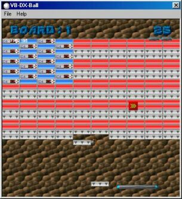



## VB\-DX\-Ball

### Description

This is VB-DX-Ball, a Breakout-clone based on DX-Ball 2. I know what you're thinking: *sarcasm* "o wow, another breakout game!" */sarcasm*, but you really should check this out. Apart from being a good example of applying DirectX in an actual game (it uses DirectDraw, DirectInput, DirectSound and DirectMusic), it's also a very cool game.

When uploading this game, I got a time-out error every time, so I decided to devote a site to it. Just go to the downloads section and download the source-code version. After you checked it out, please come back here and tell me what you think of it.
 
### More Info
 

             |
---                |---
**Submitted On**   |
**By**             |[Remco Niemeijer](https://github.com/Planet-Source-Code/PSCIndex/blob/master/ByAuthor/remco-niemeijer.md)
**Level**          |Intermediate
**User Rating**    |5.0 (15 globes from 3 users)
**Compatibility**  |VB 6\.0
**Category**       |[Games](https://github.com/Planet-Source-Code/PSCIndex/blob/master/ByCategory/games__1-38.md)
**World**          |[Visual Basic](https://github.com/Planet-Source-Code/PSCIndex/blob/master/ByWorld/visual-basic.md)
**Archive File**   |

### API Declarations

To download, go to home.wanadoo.nl/remco.niemeijer, and download the source-code from the download section or use the direct link: home.wanadoo.nl/remco.niemeijer/vbdxball.zip

### Source Code

To download, go to home.wanadoo.nl/remco.niemeijer, and download the source-code from the download section or use the direct link: home.wanadoo.nl/remco.niemeijer/vbdxball.zip

